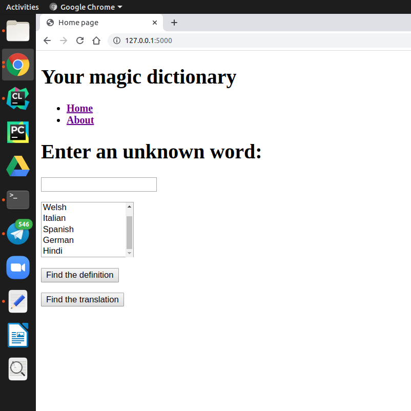

**version 1.3**

## Description

Getting the definition of the word; now translation is available!
Using Python's Flask, HTML templates and PyDictionary API 

Ubuntu 19.10
Codename: eoan

## Installing dependencies:
Create virtual environment:
`python3 -m venv venv`

Activate it:
`. venv/bin/activate`

Install newest version of pip, pip-tools and pip-chill:
`pip install --upgrade pip`

`pip install pip-tools pip-chill`

Extract minimal set of packages (ie, top-level without dependencies):
`pip install flask`

`pip install PyDictionary`

`pip install translate`

`pip-chill > requirements.txt`

## Running from the command line

`python my_server.py`  
(using python 3 by default)

While program is running you can visit my website:
http://127.0.0.1:5000/

There you'll see such window:

this is `home` page

on `about` page you can learn about me and my project
on `home` page you can insert a word in special window; afterwards, you can either choose one of six languages ans translate your word, or you can ger its definition by clicking the appropriate button  

