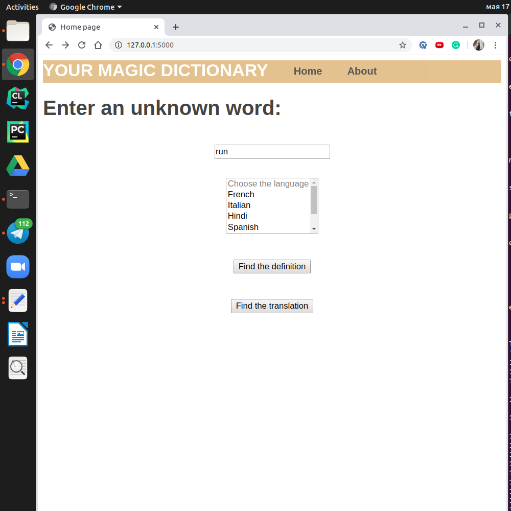

version 1.3

Getting the definition of the word; now translation is available!
Using Python's Flask, HTML templates and PyDictionary API 

You can run it via command line: 

python my_server.py
pip freeze > requirements.txt

While program is running you can visit my website:
http://127.0.0.1:5000/

There you'll see such window:

this is 'home' page

on 'about' page you can learn about me and my project
on 'home' page you can insert a word in special window; afterwards, you can either choose one of five languages ans translate your word, or you can ger its definition by clicking the appropriate button

for some words' translations there is an output {"error": "Word has no translation in API"}
it happens due to change in Google translate's policy, as PyDictionary uses Google translate
https://stackoverflow.com/questions/37009972/pydictionary-translate-returns-invalid-word-none
